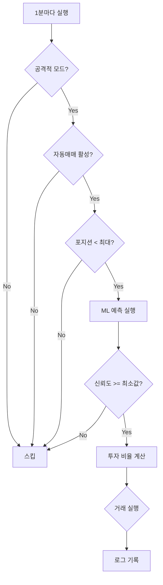

# 🚀 공격적 Tick 매매 모드

## 개요

기존 5분 주기 매매에 더해, **1분 단위 tick 매매 모드**를 추가했습니다. ML 신호만으로 빠르게 진입/청산하여 더 공격적인 수익을 추구합니다.

## 특징

### 일반 매매 (기본 모드)
- ⏰ **주기**: 5분 (300초)
- 🤖 **검증**: Groq + Ollama 양쪽 LLM 승인 필수
- 📊 **투자 비율**: LLM이 결정하거나 신뢰도 기반 (5~30%)
- 🎯 **타겟**: 안정적인 수익

### Tick 매매 (공격적 모드)
- ⚡ **주기**: 1분 (60초) - 설정 가능
- 🤖 **검증**: LLM 없이 ML 신호만 사용
- 📊 **투자 비율**: 신뢰도 기반 (15~50%)
  - 85% 이상: 50% 투자
  - 75% 이상: 30% 투자
  - 70% 이상: 15% 투자
- 🎯 **타겟**: 빠른 진입/청산으로 고수익

## 설정 방법

### 1. 환경 변수 설정 (.env)

```bash
# 공격적 매매 모드 활성화
AGGRESSIVE_TRADING_MODE=true

# Tick 매매 주기 (초단위, 기본값: 60초 = 1분)
TICK_INTERVAL_SECONDS=60

# Tick 매매 최소 신뢰도 (기본값: 0.7 = 70%)
# 이 값보다 낮은 신호는 무시됩니다
TICK_MIN_CONFIDENCE=0.7

# Tick 매매 최대 동시 포지션 수 (기본값: 5)
TICK_MAX_POSITIONS=5
```

### 2. 서버 재시작

```bash
docker compose down
docker compose up -d
```

## 추천 설정

### 보수적 설정
```bash
AGGRESSIVE_TRADING_MODE=true
TICK_INTERVAL_SECONDS=120        # 2분
TICK_MIN_CONFIDENCE=0.8          # 80% 이상만
TICK_MAX_POSITIONS=3             # 최대 3개
```

### 균형 설정 (기본값)
```bash
AGGRESSIVE_TRADING_MODE=true
TICK_INTERVAL_SECONDS=60         # 1분
TICK_MIN_CONFIDENCE=0.7          # 70% 이상
TICK_MAX_POSITIONS=5             # 최대 5개
```

### 공격적 설정
```bash
AGGRESSIVE_TRADING_MODE=true
TICK_INTERVAL_SECONDS=30         # 30초
TICK_MIN_CONFIDENCE=0.65         # 65% 이상
TICK_MAX_POSITIONS=8             # 최대 8개
```

## 위험 관리

### 내장 안전장치

1. **최소 신뢰도 필터**: 설정값 이하의 신호는 무시
2. **최대 포지션 제한**: 동시 보유 개수 제한
3. **타이트한 손절/익절**: 
   - 손절: -2% (일반 -3% 대비 타이트)
   - 익절: +3% (일반 +5% 대비 빠름)

### 주의사항

⚠️ **공격적 모드는 높은 리스크를 수반합니다**

- 빠른 매매로 수수료 증가
- LLM 검증 없어 false positive 가능
- 변동성 큰 시장에서 손실 위험 증가

💡 **권장사항**:
- 처음에는 보수적 설정으로 시작
- 소액으로 테스트 후 점진적으로 확대
- 백테스팅 결과를 먼저 확인
- 일반 모드와 병행하여 리스크 분산

## 모니터링

### 실시간 로그 확인

```bash
# Tick 매매 로그 확인
docker compose logs worker -f | grep "🚀\|⚡"

# 전체 거래 로그
docker compose logs worker -f | grep -E "(✅|❌|BUY|SELL)"
```

### 로그 예시

```
🚀 Aggressive trading mode enabled: 60s interval, min confidence 70%
⚡ Tick trade: KRW-BTC BUY at 78% confidence, 30% position
✅ BUY 주문 실행: KRW-BTC, 30,000원 (30%)
⚡ Tick trade: KRW-ETH SELL at 82% confidence, 100% position
✅ SELL 주문 실행: KRW-ETH, 0.5 ETH 전량 매도
```

## 동작 흐름



## 비교표

| 항목 | 일반 모드 | Tick 모드 |
|------|----------|-----------|
| 주기 | 5분 | 1분 (설정 가능) |
| LLM 검증 | Groq + Ollama | 없음 |
| 최소 신뢰도 | 없음 | 70% (설정 가능) |
| 투자 비율 | 5~30% | 15~50% |
| 손절 | -3% | -2% |
| 익절 | +5% | +3% |
| 속도 | 느림 (안전) | 빠름 (공격적) |
| 리스크 | 낮음 | 높음 |

## FAQ

**Q: 일반 모드와 동시에 작동하나요?**
A: 네, 두 모드는 독립적으로 동작합니다. Tick 모드를 활성화해도 기존 5분 주기 매매는 계속됩니다.

**Q: 수익이 더 높나요?**
A: 변동성이 큰 시장에서는 더 많은 기회를 잡을 수 있지만, 수수료와 리스크도 증가합니다.

**Q: 테스트는 어떻게 하나요?**
A: `TICK_MIN_CONFIDENCE=0.9`로 설정하여 매우 높은 신뢰도에만 반응하도록 하거나, `TICK_MAX_POSITIONS=1`로 제한하여 시작하세요.

**Q: 비활성화하려면?**
A: `.env`에서 `AGGRESSIVE_TRADING_MODE=false`로 설정하고 재시작하면 됩니다.
